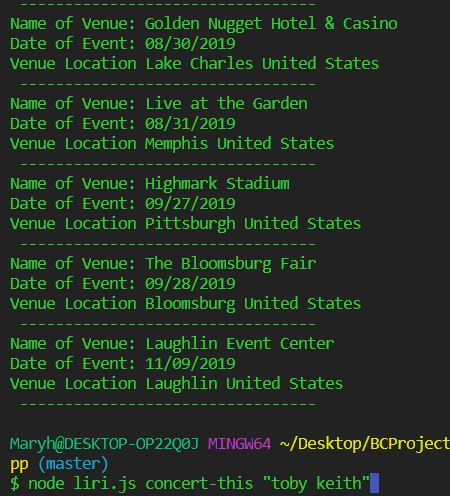
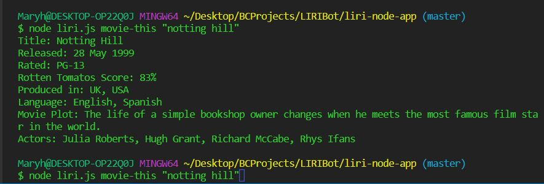
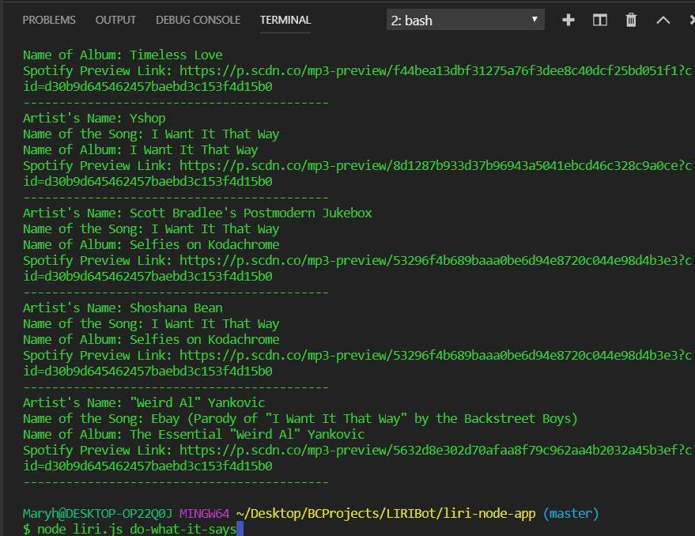
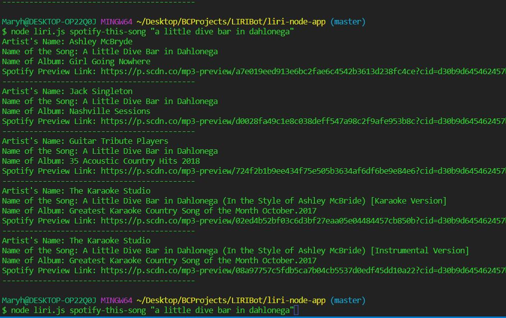
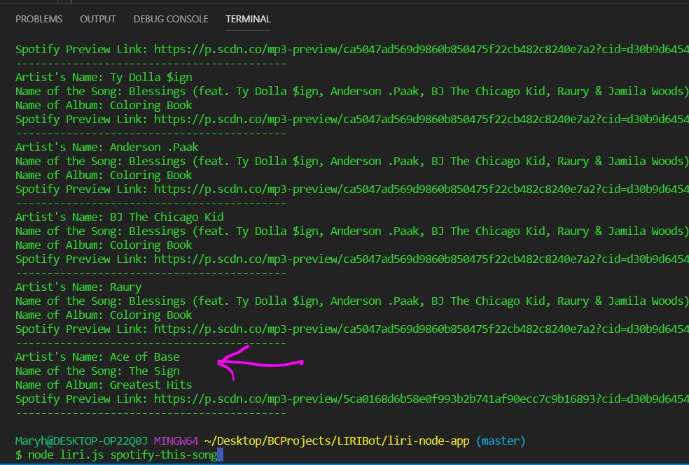
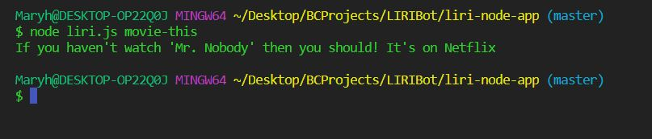

# liri-node-app

# Overview:

To work with this app, the following are required:

Spotify API Key

Installation of the following NPM packages:
*Axios

*Moment

*Node-spotify-api

# Running the App

This program is run at the command line prompt with the command:
**node liri.js** followed by the action required.

Possible actions include:

_concert-this_

_spotify-this-song_

_movie-this_

_do-what-it-says_

# Description of Allowed Commands:

__movie-this:__ provides information regarding a specific movie. 
If no movie is requested the system will suggest a movie.

  	Example:
	node liri.js movie-this “limitless”

__concert-this:__ provides information about concerts when given a specific performer or group. 
	
    Example:
	node liri.js concert-this “toby keith”

spotify-this-song: provides information regarding a specific song. If no song is entered, the program will provide information for the song “The Sign” by Ace of Base.

	Example:  node liri.js spotify-this-song “yesterday”
  
  
do-what-it-says: will take a request from text stored in the random.txt file and execute the request.

	Example:
	node liri.js do-what-it-says

# Example of concert-this "toby keith"

# Example of movie-this "notting hill"

# Example of "do-what-it-says"

# Example of spotify-this-song A Little Dive Bar in Dahlonega"

# Example of Response to "spotify-this-song" when Provided No Parameters:

# Example of Response to "movie-this" when Provided No Parameters:

